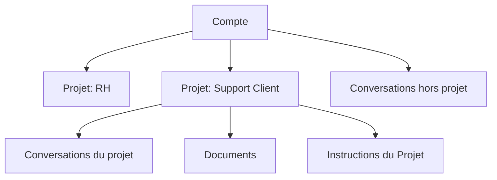

# Projets dans l'Assistant

Les projets sont le conteneur principal qui organise votre travail sur la plateforme. Chaque projet est un système prompt spécialisé combiné à des fichiers, vous permettant de créer autant de conversations que souhaité.

## La hiérarchie

Votre compte contient des projets. Chaque projet contient des conversations et des documents.

Vous pouvez également créer des conversations indépendantes (c'est a dire reliée à aucun projet).





## Recherche

La recherche permet de chercher une conversation par son titre.&#x20;

Vous pouvez accéder à la recherche grace au bouton "Rechercher" ou avec le racourci Ctrl + K (Cmd + K sur Mac)

L'affichage des conversations dans la barre de recherche inclus le titre du projet dans lequel elle se trouve pour faciliter l'identification de celles-cis.

## Projets

Un projet est un [système prompt](../reference/glossary.md#système-prompt) spécialisé combiné à des fichiers. Chaque projet permet de créer autant de conversations que souhaité, avec des interactions qui suivent les instructions spécialisées du projet et peuvent rechercher dans ses documents.


Pour l'instant, les projets ne construisent pas d'historique commun. Pour faire évoluer le comportement de l'Assistant au sein d'un projet, il convient donc de modifier ses instructions et de rajouter des documents.&#x20;


Les projets sont isolés les uns des autres. Les documents, l'historique des conversations et les configurations ne se partagent pas entre les projets.

## Ressources connexes
