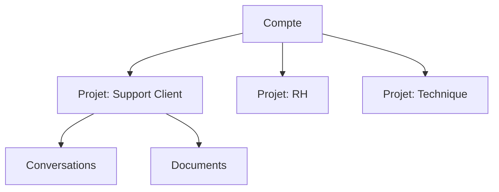

# Projets

Les projets sont le conteneur principal qui organise votre travail sur la plateforme. Chaque projet est un système prompt spécialisé combiné à des fichiers, vous permettant de créer autant de conversations que souhaité.

## La hiérarchie

Votre compte contient des projets. Chaque projet contient des conversations et des documents.

## Projets

Un projet est un [système prompt](../glossary.md#système-prompt) spécialisé combiné à des fichiers. Chaque projet permet de créer autant de conversations que souhaité, avec des interactions qui suivent les instructions spécialisées du projet et peuvent rechercher dans ses documents.

| Composant | À quoi ça sert | |
|-----------|---------------| |
| **Prompt système** | Les instructions spécialisées qui guident toutes les conversations du projet | |
| **Documents** | Les fichiers accessibles pour la recherche et le contexte | |
| **Conversations** | Historique de toutes les interactions utilisateur | |
| **Paramètres** | Configuration pour les réponses, le comportement et l'apparence | |

Les projets sont isolés les uns des autres. Les documents, l'historique des conversations et les configurations ne se partagent pas entre les projets.

## Quand diviser en plusieurs projets

Une question courante : « Faut-il en faire un seul ou plusieurs ? »

Utilisez **des projets séparés** quand :

- Ils servent des objectifs différents (ex: support vs. technique)
- Ils ont besoin de documents différents

Utilisez **un seul projet** quand :

- C'est le même cas d'usage avec un seul ensemble d'instructions spécialisées
- Vous souhaitez centraliser les documents et le contexte
- Les différences sont mineures et peuvent être gérées dans un seul projet

## Ressources connexes


[autorisations.md](permissions.md)



[configuration.md](../reference/configuration.md)

