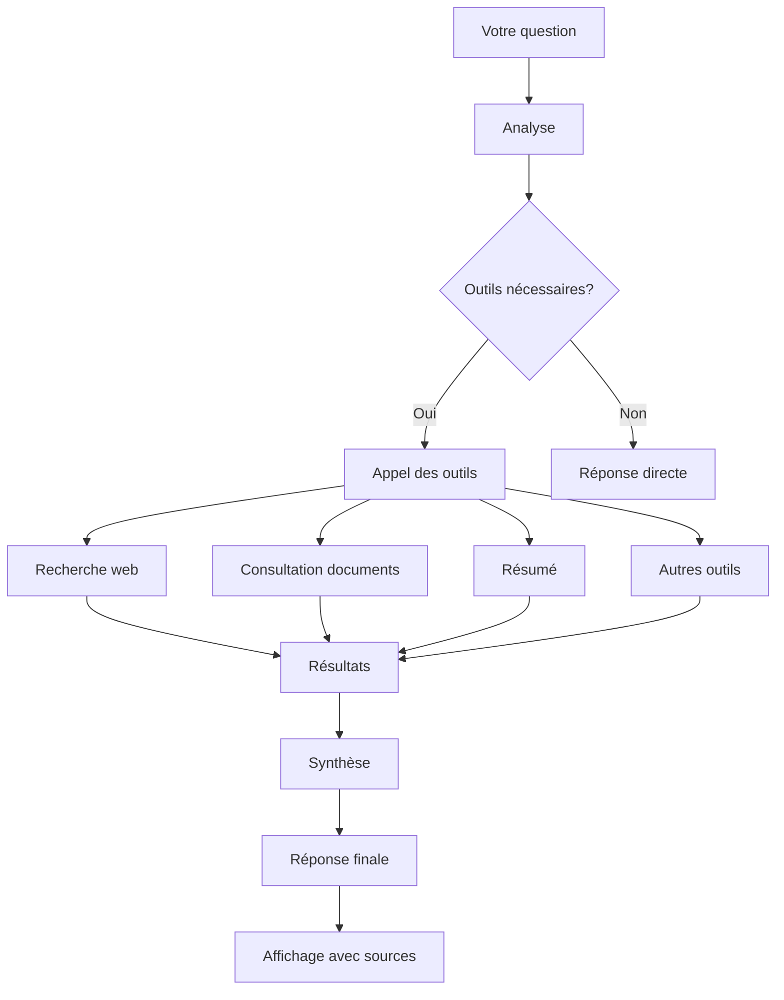

# Fonctionnement de votre assistant IA

Votre assistant IA est pré-configuré pour répondre à vos questions de manière optimale. Cette page explique comment fonctionne votre assistant et quelles sont ses capacités, basées sur les fonctionnalités réellement disponibles dans l'application.

## Fonctionnalités principales

Votre assistant prend en charge plusieurs outils et fonctionnalités avancés :

### 🎯 Outils intégrés

| Outil | Description | Statut |
|-------|-------------|--------|
| **Conversation** | Chat intelligent avec continuation automatique après les erreurs | ✅ Actif |
| **Recherche Web (Brave)** | Recherche en temps réel avec résumé automatique | ✅ Actif |
| **Upload de documents** | Glisser-déposer de fichiers sur toute la page | ✅ Actif |
| **Résumé automatique** | Résumé intelligent de documents et conversations | ✅ Actif |
| **Bases documentaires** | Organisation de documents et ressources | ✅ Actif |
| **Sélection de modèles** | Choix entre Mistral Large, Mistral Small, Code Llama, etc. | ✅ Actif |

### 📋 Gestion des documents

- **Glisser-déposer** : Déposez des fichiers n'importe où sur la page (#104)
- **Types de fichiers supportés** : PDF, Word, Markdown, TXT, Excel, etc.
- **Types de fichiers bloqués** : Exécutables, scripts, archives (.exe, .bat, .sh, .zip, .rar, etc.) (#139)
- **Taille maximale** : 10 Mo par fichier (configurable)
- **Parsing amélioré** : Meilleure analyse et affichage des documents (#167)
- **Affichage des longs prompts** : Gestion optimisée des messages longs (#174)

### 🌐 Recherche Web

- **Moteur** : Brave Search (respect de la vie privée)
- **Résumé automatique** : Synthèse des résultats de recherche
- **Filtrage intelligent** : Priorisation des sources fiables
- **Ouvrir dans un nouvel onglet** : Les liens dans les réponses s'ouvrent dans un nouvel onglet par défaut (#103)

### 🤖 Modèles disponibles

| Modèle | Spécialisation | Disponibilité |
|--------|----------------|---------------|
| **Mistral Large** | Puissant et polyvalent | ✅ Standard |
| **Mistral Small** | Rapide et économique | ✅ Standard |
| **Code Llama** | Génération de code | ✅ Standard |
| **Modèle par défaut** | Équilibré | ✅ Standard |

- **Sélection directe** : Choisissez le modèle dans l'interface de chat
- **Appels d'outils** : Remplace le routage traditionnel (#40)
- **Noms courts étendus** : Support des noms plus longs (#182)

### 📊 Analytique et scoring

- **Langfuse** : Suivi des conversations et évaluation des réponses
- **PostHog** : Analytique de l'application avec respect de la vie privée
- **Scoring des messages** : Évaluez les réponses avec 👍 ou 👎
- **Commentaires** : Ajoutez des explications à vos évaluations
- **Statistics par utilisateur** : Suivi de votre utilisation personnelle
- **Statistics globales** : Analyse pour les administrateurs (anonymisées)

## Comment votre assistant fonctionne

### Architecture

Votre assistant utilise une architecture basée sur des **appels d'outils** (tool calls) :

1. **Analyse de votre question** : Identification de l'intention et des outils nécessaires
2. **Sélection des outils** : L'assistant détermine quels outils utiliser (recherche web, résumé, documents, etc.)
3. **Exécution** : Appel des outils appropriés avec vos paramètres
4. **Synthèse** : Combinaison des résultats pour générer une réponse cohérente
5. **Présentation** : Affichage formaté avec sources et suggestions

### Flux de traitement d'une question

## Capacités détaillées

### Conversation intelligente

✅ **Continuation après erreur** : La conversation se poursuit même après une erreur (#99)
✅ **Contexte maintenu** : L'assistant se souvient du contexte de la session
✅ **Historique complet** : Accès à toutes vos conversations précédentes
✅ **Multilingue** : Support du français, anglais, et autres langues
✅ **Personnalisation** : Adaptation à vos préférences et habitudes

### Gestion des documents

✅ **Glisser-déposer partout** : Déposez des fichiers n'importe où sur la page (#104)
✅ **Traitement automatique** : Indexation et extraction de texte
✅ **Parsing amélioré** : Meilleure analyse des documents (#167)
✅ **Affichage optimisé** : Gestion des longs prompts (#174)
✅ **Types de fichiers variés** : PDF, Word, Markdown, Excel, etc.
✅ **Sécurité renforcée** : Blocage des fichiers dangereux (#139)

### Recherche Web

✅ **Recherche en temps réel** : Accès aux informations à jour
✅ **Brave Search** : Moteur respectueux de la vie privée
✅ **Résumé automatique** : Synthèse des résultats
✅ **Nouvel onglet par défaut** : Les liens s'ouvrent dans un nouvel onglet (#103)
✅ **Filtrage intelligent** : Sources fiables priorisées
✅ **Personnalisation** : Paramètres de recherche avancés

### Outils de productivité

✅ **Résumé automatique** : Documents, conversations, résultats de recherche
✅ **Collection intelligente** : Organisation automatique des documents
✅ **Recherche avancée** : Opérateurs de recherche puissants
✅ **Export** : Exportation des conversations et documents
✅ **Partage** : Partage de projets

## Personnalisation

### Préférences utilisateur

Vous pouvez personnaliser :

- **Modèle par défaut** : Le modèle utilisé pour les nouvelles conversations
- **Taille de la police** : Agrandir ou réduire le texte
- **Mode sombre** : Pour une meilleure visibilité
- **Langue** : Langue de l'interface et des réponses
- **Raccourcis clavier** : Activez/désactivez les raccourcis étendus

### Paramètres par conversation

Pour chaque conversation, vous pouvez :

- **Changer de modèle** : Sélectionnez un autre LLM
- **Ajuster les paramètres** : Température, longueur maximale, etc.
- **Activer/désactiver des outils** : Recherche web, résumé, etc.
- **Gérer les documents** : Ajouter, supprimer, organiser

## Raccourcis clavier

| Raccourci | Action | Disponible |
|----------|--------|-----------|
| `Ctrl + K` | Recherche globale | ✅ Oui |
| `Ctrl + N` | Nouvelle conversation | ✅ Oui |
| `Ctrl + Shift + N` | Nouveau document | ✅ Oui |
| `Ctrl + ,` | Préférences | ✅ Oui |
| `Ctrl + .` | Aide | ✅ Oui |
| `Tab` | Navigation | ✅ Oui |
| `Échap` | Fermer | ✅ Oui |

## Bonnes pratiques d'utilisation

### Pour de meilleures réponses

1. **Soyez spécifique** : Plus votre question est précise, meilleure sera la réponse
2. **Donnez du contexte** : Expliquez la situation ou le problème
3. **Utilisez les bons outils** : Choisissez l'outil adapté à votre besoin
4. **Évaluez les réponses** : Utilisez 👍/👎 pour améliorer la qualité
5. **Consultez les sources** : Vérifiez les informations dans les documents originaux

### Gestion des documents

1. **Organisez vos projets** : Une collection par projet ou thème
2. **Nommez clairement** : Utilisez des noms descriptifs pour les fichiers
3. **Vérifiez les types** : Seuls les types supportés seront acceptés
4. **Respectez les limites** : Taille maximale de 10 Mo par fichier
5. **Partagez prudemment** : Ne partagez pas de documents sensibles

### Recherche Web

1. **Soyez précis** : Des requêtes spécifiques donnent de meilleurs résultats
2. **Vérifiez les sources** : Croisez les informations avec d'autres sources
3. **Respectez le copyright** : Ne copiez pas du contenu protégé
4. **Utilisez des filtres** : Site:, après:, lang: pour affiner
5. **Combinez avec les documents** : Recherche web + documents internes

## Sécurité et confidentialité

### Protection intégrée

✅ **Chiffrement** : Toutes les communications sont sécurisées
✅ **Conformité RGPD** : Respect des réglementations européennes
✅ **Anonymisation** : Les statistiques sont anonymisées
✅ **Consentement** : Vous contrôlez vos préférences de suivi
✅ **Accès contrôlé** : Seuls les utilisateurs autorisés peuvent accéder aux fonctionnalités

### Ce que nous NE faisons PAS

❌ **Ne suivons pas** votre activité en dehors de l'application
❌ **Ne partageons pas** vos données personnelles
❌ **Ne vendons pas** vos informations
❌ **N'accédons pas** à vos documents sans permission
❌ **Ne stockons pas** vos données plus longtemps que nécessaire

### Vos droits

- **Droit d'accès** : Savoir quelles données nous détenons
- **Droit de rectification** : Corriger les informations inexactes
- **Droit d'effacement** : Supprimer vos données
- **Droit d'opposition** : Refuser le traitement de vos données
- **Droit à la portabilité** : Exporter vos données

## Dépannage

### Problèmes courants et solutions

La conversation s'arrête après une erreur

Cela ne devrait plus arriver grâce à la fonction de continuation automatique (#99). Si le problème persiste :
- Rafraîchissez la page
- Essayez de commencer une nouvelle conversation
- Vérifiez votre connexion internet
- Contactez le support

Je ne peux pas déposer de fichiers

- Vérifiez que vous utilisez un type de fichier supporté
- Essayez de déposer le fichier dans le champ de message
- Vérifiez que le fichier n'est pas trop grand (>10 Mo)
- Assurez-vous que le fichier n'est pas bloqué (#139)
- Essayez avec un autre navigateur

La recherche web ne fonctionne pas

- Vérifiez que vous avez une connexion internet stable
- Assurez-vous que la recherche web est activée
- Essayez une requête plus simple
- Vérifiez que Brave Search n'est pas bloqué par votre réseau
- Contactez votre administrateur

Le résumé est incomplet

- Vérifiez que le document a été correctement uploadé
- Essayez de demander un résumé plus détaillé
- Demandez un résumé par sections
- Vérifiez que l'indexation est terminée

Je ne vois pas le bouton de copie pour le code

La fonction de copie pour les blocs de code est disponible (#153, #164). Si vous ne la voyez pas :
- Survolez le bloc de code
- Le bouton de copie (📋) devrait apparaître
- Essayez de rafraîchir la page
- Vérifiez que vous utilisez la dernière version

Les liens ne s'ouvrent pas dans un nouvel onglet

Tous les liens dans les réponses de l'assistant devraient s'ouvrir dans un nouvel onglet par défaut (#103). Si ce n'est pas le cas :
- Vérifiez les paramètres de votre navigateur
- Essayez un clic droit > "Ouvrir dans un nouvel onglet"
- Contactez le support

## Mentions légales

Consultez nos documents juridiques :

- [Modalités d'utilisation](/legal/terms)
- [Politique de confidentialité](/legal/privacy)
- [Déclaration d'accessibilité](/accessibilite)

## Support

Si vous avez besoin d'aide :

1. **Consultez cette documentation** pour des réponses aux questions courantes
2. **Demandez à l'assistant** lui-même - il peut souvent répondre à vos questions
3. **Contactez le support** : support@votreentreprise.com
4. **Consultez les FAQ** : [Lien vers la FAQ]

## Changelog

Pour voir les dernières améliorations et corrections :

- **Fonctionnalité** : Ajout de la sélection de modèles, recherche web, Projets et bases documentaires
- **Corrections** : Parsing des documents (#167), affichage des longs prompts (#174), continuation après erreur (#99)
- **Sécurité** : Blocage des fichiers dangereux (#139)
- **UX** : Glisser-déposer étendu (#104), liens dans nouveaux onglets (#103), bouton de copie pour le code (#153, #164)
- **Analytique** : Intégration Langfuse et PostHog pour le scoring et les statistiques

Cette documentation est mise à jour régulièrement pour refléter les dernières fonctionnalités de l'application.
